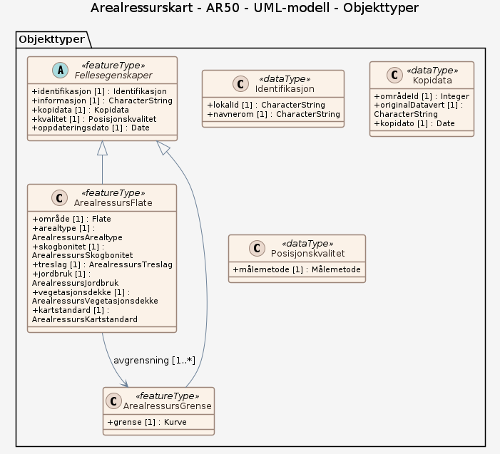

# Produktspesifikasjon: Arealressurskart - AR50

*AR50 er et landsdekkende arealressurskart som viser Norges arealressurser i en mer forenklet og grov skala enn FKB-AR5. Datasettet er tilpasset målestokk fra 1:20 000 til 1:100 000, og gir oversiktlig informasjon om arealtyper på regionalt og nasjonalt nivå.

Kartet er i hovedsak basert på generalisering av FKB-AR5 under tregrensen, kombinert med tolkning av satellittbilder over tregrensen. Resultatet er et heldekkende kart som gir oversikt over arealressursene i hele landet. 

Områder klassifisert som Åpen fastmark eller Ikke kartlagt i FKB-AR5 suppleres med data fra N50 Kartdata og vegetasjonsdekke fra AR-FJELL for å redusere arealer som klassifiseres som snaumark i AR50. Det vil likevel fortsatt gjenstå arealer klassifisert som Snaumark.*

**Nøkkelord:** arealressurs, arealtype, bonitet, skogbonitet, treslag, snaumark, jordbruksareal, AR50, Norge, Arealdekke, Norge digitalt, Åpne data, modellbaserteVegprosjekter, fellesDatakatalog, Det offentlige kartgrunnlaget, Basis geodata, Landbruk, Natur

**Emnekategorier:** Landbruk og havbruk

**Geografisk utstrekning**:

- **Vest**: 2.0
- **Øst**: 33.0
- **Sør**: 57.0
- **Nord**: 72.0

**Tidsmessig utstrekning**:

- **Tidsperiode**:
  - **Fra**: 2007-05-02
  - **Til**: 2026-03-16

## Om spesifikasjonen

> **Denne versjonen av produktspesifikasjonen:**  
> **Opprettet dato:** 2007-05-02 
> **Endret dato:** 2026-03-16 
> **Språk:** nor 
> **Kontaktinformasjon:** Norsk institutt for bioøkonomi, [gisdrift@nibio.no](mailto:gisdrift@nibio.no)

## Om produktet Arealressurskart - AR50

> **Romlig representasjonstype:** Vektor 
> **Unik identifikator:** 4bc2d1e0-f693-4bf2-820d-c11830d849a3 
> **Kontaktinformasjon:** Norsk institutt for bioøkonomi, [gisdrift@nibio.no](mailto:gisdrift@nibio.no)
>
> **Romlig oppløsning:**
>
> **Ekvivalent målestokk**: Fra 1:20 000 til 1:100 000
>
> **Begrensninger:**
>
> **Juridiske begrensninger**:
>
> - **Tilgangsbegrensninger**: Åpne data
> - **Bruksbegrensninger**: Lisens
> - **Lisens**: Norsk lisens for offentlige data (NLOD)
> - **Lisenslenke**: <http://data.norge.no/nlod/no/1.0>
>
> **Sikkerhetsbegrensninger**:
>
> - **Klassifisering**: Ugradert

### Formål

Formålet med AR50 er å gi en forenklet og tilgjengelig oversikt over Norges arealressurser, tilpasset bruk i mindre målestokker og i sammenhenger der detaljeringsnivået i FKB-AR5 er for høyt.

Datasettet skal gjøre det enklere å visualisere og analysere arealressurser på tvers av større geografiske områder, og gi et felles grunnlag for oversikt og sammenstilling av arealinformasjon.

### Bruksområde

AR50 brukes blant annet til:
* visualisering av arealressurser i temakart og kartpresentasjoner
* analyser på regionalt og nasjonalt nivå
* grunnlag i overordnet planlegging, for eksempel kommuneplan, landbruksplan og arbeid med kjerneområder landbruk

AR50 er utviklet for oversiktsformål og egner seg best når det er behov for et forenklet arealressurskart eller analyser på regionalt og nasjonalt nivå. AR50 brukes ofte der det ikke er behov for den detaljerte informasjonen som finnes i FKB-AR5, eller der datamengde og ytelse er viktig. 

På grunn av generalisering er datasettet ikke egnet til detaljert saksbehandling eller vurderinger på eiendomsnivå. For slike formål, og for produksjon av arealstatistikk, bør man som hovedregel bruke FKB-AR5. AR50 egner seg heller ikke til analyser av endringer over tid, siden datasettet ikke oppdateres årlig og bygger på kildedata med ulik oppdateringsfrekvens. Endringer mellom versjoner gjenspeiler i stor grad forbedringer i datagrunnlaget, og ikke nødvendigvis reelle endringer i arealbruk.

## Omfang

### Hele datasettet

**Nivå**: dataset

**Nivåbeskrivelse**: Gjelder hele datasettet. Hvis omfang ikke er oppgitt under en overskrift, gjelder teksten for hele datasettet og alle leveranser

### UML-modell

**Nivå**: dataset

## Datainnhold og struktur

### Datamodell - UML-modell

➡️ [Se full datamodell for omfang "UML-modell" (diagram per pakke og objektkatalog)](uml-modell/objektkatalog.html)

## Referansesystem

| EPSG-kode | Navn på referansesystem |
| --- | --- |
| [EPSG:4258](https://epsg.io/4258) | [EUREF 89 Geografisk (ETRS 89) 2d](https://register.geonorge.no/epsg-koder) |
| [EPSG:25832](https://epsg.io/25832) | [EUREF89 UTM sone 32, 2d](https://register.geonorge.no/epsg-koder) |
| [EPSG:25835](https://epsg.io/25835) | [EUREF89 UTM sone 35, 2d](https://register.geonorge.no/epsg-koder) |
| [EPSG:25833](https://epsg.io/25833) | [EUREF89 UTM sone 33, 2d](https://register.geonorge.no/epsg-koder) |

## Datakvalitet

**Nivå**: dataset

- **Kvalitetsmål**: SOSI-produktspesifikasjon: AR50
  **Målebeskrivelse**: Dataene er ikke vurdert iht produktspesifikasjonen
  **Beskrivende resultat**: Dataene er ikke vurdert iht produktspesifikasjonen

- **Kvalitetsmål**: Sosi applikasjonsskjema
  **Målebeskrivelse**: SOSI-filer er ikke vurdert i henhold til applikasjonsskjema
  **Beskrivende resultat**: SOSI-filer er ikke vurdert i henhold til applikasjonsskjema

- **Kvalitetsmål**: Sosi applikasjonsskjema
  **Målebeskrivelse**: GML-filer er ikke vurdert i henhold til applikasjonsskjema
  **Beskrivende resultat**: GML-filer er ikke vurdert i henhold til applikasjonsskjema

- **Kvalitetsmål**: Prosentvis oppfyllelse av FAIR-prinsipper
  **Målebeskrivelse**: Angir fullstendighet i forhold til krav fra FAIR-prinsippene (The FAIR Guiding Principles for scientific data management and stewardship)
  **Resultat**: 91

- **Kvalitetsmål**: FAIR
  **Resultat**: Prosentvis oppfyllelse av FAIR-prinsipper: 91%

## Datafangst og produksjon

**Datainnsamling og prosessering**:

- **Prosesstrinn**:
  - **Beskrivelse**:
    AR50 oppdateres om lag hvert tredje år, og produseres helautomatisk gjennom en regelbasert prosess der flere datasett sammenstilles. AR50 fra mars 2025 er nyeste versjon og er basert på AR5-årsversjon 2024, N50 Kartdata og ARFJELL2 (2021).

    Første versjon av AR50 ble etablert i 2010, basert på FKB-AR5 og N50 Kartdata per 31.12.2010, samt satellittdata fra perioden 1994–2006 (IMAGE2000). Datasettet er senere oppdatert i nye versjoner i 2013, 2016 og 2021, basert på oppdaterte versjoner av FKB-AR5 og N50 Kartdata, samt AR-FJELL2 (produsert fra satellittbilder fra Sentinel 2-satellitten).

## Vedlikehold

**Vedlikeholdsfrekvens**: Ujevnt

**Status**: Fullført

## Presentasjon

**navn**: Tegneregler

**Lenke**:
<https://register.geonorge.no/tegneregler/ar50>

## Leveranse

| Tjeneste | Endepunkt | Type | Format | Leveranseenheter |
| --- | --- | --- | --- | --- |
| Geonorge nedlastning | [Lenke](https://kart8.nibio.no/api/capabilities/) | GEONORGE:DOWNLOAD | SOSI, GML, FGDB | fylkesvis, kommunevis |
| Atom Feed | [Lenke](https://kartkatalog.nibio.no/api/atom/4bc2d1e0-f693-4bf2-820d-c11830d849a3) | W3C:AtomFeed | GDB, GML, SOSI | fylkesvis, kommunevis |
| Arealressurskart - AR50 - WMS | [Lenke](https://wms.nibio.no/cgi-bin/ar50_2?SERVICE=WMS&VERSION=1.3.0&REQUEST=GetCapabilities) | Tjenestelag | WMS |  |
| GeoPackage: uml-modell | [Lenke](https://raw.githubusercontent.com/ToreFreddyB/produktspesifikasjon_nibio/main/produktspesifikasjon/arealressurskart-ar50/uml-modell/uml-modell.gpkg) | Nedlasting | GPKG |  |
| GML/XSD-skjema: uml-modell | [Lenke](https://raw.githubusercontent.com/ToreFreddyB/produktspesifikasjon_nibio/main/produktspesifikasjon/arealressurskart-ar50/uml-modell/schema/xsd/INPUT/uml-modell.xsd) | Nedlasting | XSD |  |

## Metadata

**Metadatastandard**: ISO19115

**Metadatastandardversjon**: 2003

**Metadatadato**: 2026-09-08

**språk**: nor

**Kontakt**:

- **Organisasjon**: Norsk institutt for bioøkonomi
- **Kontaktperson**: Maria Oldeman Lund
- **Logo**: <https://register.geonorge.no/data/organizations/988983837_NIBIO_liten.jpg>
- **Epost**: gisdrift@nibio.no
- **rolle**: pointOfContact

**Metadataidentifikator**:

- **Utsteder**: Geonorge
- **kode**: 4bc2d1e0-f693-4bf2-820d-c11830d849a3
- **koderom**: <https://kartkatalog.geonorge.no/metadata/>
- **Metadatalenke**: <https://kartkatalog.geonorge.no/metadata/4bc2d1e0-f693-4bf2-820d-c11830d849a3>

## Tilleggsinformasjon

Datasettet viser arealfigurer (flater) med egenskapene (beskrevet i egne temaartikler på produktsiden):
* arealtype  (ARTYPE)
* jordbruksareal (ARJORDBRUK)
* treslag (ARTRESLAG)
* skogbonitet (ARSKOGBON) 
* snaumark (ARVEGET)

AR50 har god dekning, men lavere detaljnivå enn kildedataene. Små arealer under 15 dekar vises ikke som egne flater, men er slått sammen med omkringliggende arealer. Arealfigurer i nedlastede datasett er klippet til kommunegrenser. For romlige analyser og fremstilling av arealstatistikk anbefales det at man bruker FKB-AR5. I romlige analyser og arealstatistikk på internasjonalt nivå bør Corine Landcover brukes.

For riktige arealtall skal egenskapen area_c brukes, her er arealet beregnet etter evt. klipping. Egenskapen areal inneholder areal-verdien på hele figurer i vår sømløse original-database som nedlastingen er hentet fra. Det kan også være små forskjeller mellom area_c og areal selv om figurene i uttrekket ikke er blitt delt/klippet. Dette skyldes avrundingsforskjeller og transformasjon mellom forskjellige koordinatsystem.

Les mer på produktsiden hos NIBIO, og se særlig temaartiklene for en grundigere innføring i datasettet!

- **Produktark:** [https://register.geonorge.no/produktark/ar50](https://register.geonorge.no/produktark/ar50)
- **Produktside:** [https://nibio.no/tema/jord/arealressurser/ar50](https://nibio.no/tema/jord/arealressurser/ar50)
