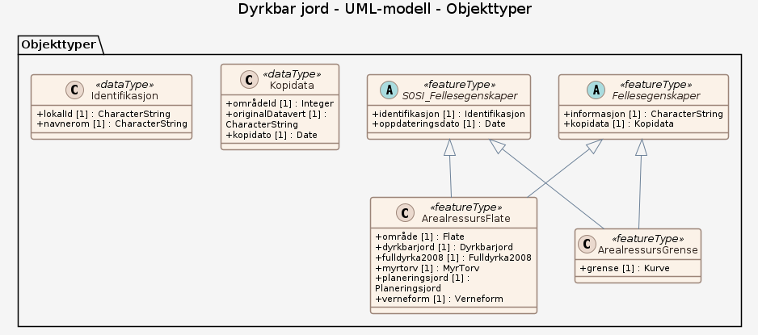

### Datamodell

**Kilde:** [SOSI UML XMI-fil](https://sosi.geonorge.no/svn/SOSI/SOSI%20Del%203/Skog%20og%20landskap/Produktspesifikasjon%20Dyrkbarjord-20250326.xml)

#### ArealressursFlate

et sammenhengende areal som er tilordnet de samme egenskapsverdiene i henhold til et Arealressursklassifikasjonssystem   -- Definition -- a continuous area which has been assigned the same attribute values in accordance with an area resource classification system

Egenskaper

<table class="feature-attribute-table">
  <colgroup>
    <col style="width: 35%;" />
    <col style="width: 65%;" />
  </colgroup>
  <tbody>
    <tr>
      <th scope="row">Navn:</th>
      <td><strong>område</strong></td>
    </tr>
    <tr>
      <th scope="row">Definisjon:</th>
      <td>objektets utstrekning  -- Definition -- area over which an object extends</td>
    </tr>
    <tr>
      <th scope="row">Multiplisitet:</th>
      <td>1</td>
    </tr>
    <tr>
      <th scope="row">Type:</th>
      <td>Flate</td>
    </tr>
  </tbody>
</table>

<table class="feature-attribute-table">
  <colgroup>
    <col style="width: 35%;" />
    <col style="width: 65%;" />
  </colgroup>
  <tbody>
    <tr>
      <th scope="row">Navn:</th>
      <td><strong>dyrkbarjord</strong></td>
    </tr>
    <tr>
      <th scope="row">Definisjon:</th>
      <td>informasjon om dyrkingsjord på snaumark, myr og skog  -- Definition -- information concerning arable land on bare land, marsh and forest</td>
    </tr>
    <tr>
      <th scope="row">Multiplisitet:</th>
      <td>1</td>
    </tr>
    <tr>
      <th scope="row">Type:</th>
      <td>Dyrkbarjord</td>
    </tr>
    <tr>
      <th scope="row">Tillatte verdier:</th>
      <td>- dyrkbarjord</td>
    </tr>
  </tbody>
</table>

<table class="feature-attribute-table">
  <colgroup>
    <col style="width: 35%;" />
    <col style="width: 65%;" />
  </colgroup>
  <tbody>
    <tr>
      <th scope="row">Navn:</th>
      <td><strong>fulldyrka2008</strong></td>
    </tr>
    <tr>
      <th scope="row">Definisjon:</th>
      <td>Informasjon om arealtilstand er endret etter 2008 som følge av ajourhold av AR5.</td>
    </tr>
    <tr>
      <th scope="row">Multiplisitet:</th>
      <td>1</td>
    </tr>
    <tr>
      <th scope="row">Type:</th>
      <td>Fulldyrka2008</td>
    </tr>
    <tr>
      <th scope="row">Tillatte verdier:</th>
      <td>- fulldyrka2008</td>
    </tr>
  </tbody>
</table>

<table class="feature-attribute-table">
  <colgroup>
    <col style="width: 35%;" />
    <col style="width: 65%;" />
  </colgroup>
  <tbody>
    <tr>
      <th scope="row">Navn:</th>
      <td><strong>myrtorv</strong></td>
    </tr>
    <tr>
      <th scope="row">Multiplisitet:</th>
      <td>1</td>
    </tr>
    <tr>
      <th scope="row">Type:</th>
      <td>MyrTorv</td>
    </tr>
    <tr>
      <th scope="row">Tillatte verdier:</th>
      <td>- mineraljord–DyrkbarMineraljord – Dyrkbar jord på areal som hverken er registrert med grunnforhold organiske jordlag eller myr i AR5 - myr–DyrkbarMyr – Dyrkbar jord på areal som er registrert som myr i AR5 - torvmark–DyrkbarTorvmark – Dyrkbar jord på areal med grunnforhold organiske jordlag i AR5 men som ikke er registrert som myr i AR5</td>
    </tr>
  </tbody>
</table>

<table class="feature-attribute-table">
  <colgroup>
    <col style="width: 35%;" />
    <col style="width: 65%;" />
  </colgroup>
  <tbody>
    <tr>
      <th scope="row">Navn:</th>
      <td><strong>planeringsjord</strong></td>
    </tr>
    <tr>
      <th scope="row">Multiplisitet:</th>
      <td>1</td>
    </tr>
    <tr>
      <th scope="row">Type:</th>
      <td>Planeringsjord</td>
    </tr>
    <tr>
      <th scope="row">Tillatte verdier:</th>
      <td>- kartlagt – Dyrkbar jord på areal som historisk er kartlagt som planeringsjord og som ligger i kartlagte ravineområder - modellert – Dyrkbar jord på areal som historisk er kartlagt som planeringsjord og som ligger i modellerte ravineområder</td>
    </tr>
  </tbody>
</table>

<table class="feature-attribute-table">
  <colgroup>
    <col style="width: 35%;" />
    <col style="width: 65%;" />
  </colgroup>
  <tbody>
    <tr>
      <th scope="row">Navn:</th>
      <td><strong>verneform</strong></td>
    </tr>
    <tr>
      <th scope="row">Multiplisitet:</th>
      <td>1</td>
    </tr>
    <tr>
      <th scope="row">Type:</th>
      <td>Verneform</td>
    </tr>
    <tr>
      <th scope="row">Tillatte verdier:</th>
      <td>- verneform-Nasjonalpark – Dyrkbar jord i nasjonalpark - verneform-Naturreservat – Dyrkbar jord i naturreservat</td>
    </tr>
  </tbody>
</table>

Relasjoner

**Arv**
SOSI_Fellesegenskaper, Fellesegenskaper

#### Fellesegenskaper (abstrakt)

abstrakt objekt som bærer en rekke egenskaper som er fagområde-uavhengige og kan benyttes for alle objekttyper  Merknad: Spesielt i produktspesifikasjonsarbeid vil en velge egenskaper og av grensningslinjer fra denne klassen.

Egenskaper

<table class="feature-attribute-table">
  <colgroup>
    <col style="width: 35%;" />
    <col style="width: 65%;" />
  </colgroup>
  <tbody>
    <tr>
      <th scope="row">Navn:</th>
      <td><strong>informasjon</strong></td>
    </tr>
    <tr>
      <th scope="row">Definisjon:</th>
      <td>generell opplysning  Merknad: mulighet til å legge inn utfyllende informasjon om objektet</td>
    </tr>
    <tr>
      <th scope="row">Multiplisitet:</th>
      <td>1</td>
    </tr>
    <tr>
      <th scope="row">Type:</th>
      <td>CharacterString</td>
    </tr>
  </tbody>
</table>

<table class="feature-attribute-table">
  <colgroup>
    <col style="width: 35%;" />
    <col style="width: 65%;" />
  </colgroup>
  <tbody>
    <tr>
      <th scope="row">Navn:</th>
      <td><strong>kopidata</strong></td>
    </tr>
    <tr>
      <th scope="row">Definisjon:</th>
      <td>angivelse av at objektet er hentet fra en kopi av originaldata Merknad: Kan benyttes dersom man gjør et uttak av en database som ikke inneholder originaldataene.</td>
    </tr>
    <tr>
      <th scope="row">Multiplisitet:</th>
      <td>1</td>
    </tr>
    <tr>
      <th scope="row">Type:</th>
      <td>Kopidata</td>
    </tr>
  </tbody>
</table>

<table class="feature-attribute-table">
  <colgroup>
    <col style="width: 35%;" />
    <col style="width: 65%;" />
  </colgroup>
  <tbody>
    <tr>
      <th scope="row">Navn:</th>
      <td><strong>kopidata.områdeId</strong></td>
    </tr>
    <tr>
      <th scope="row">Definisjon:</th>
      <td>identifikasjon av område som dataene dekker  Merknad: Kan angis med kommunenummer eller fylkesnummer. Disse bør spesifiseres nærmere.</td>
    </tr>
    <tr>
      <th scope="row">Multiplisitet:</th>
      <td>1</td>
    </tr>
    <tr>
      <th scope="row">Type:</th>
      <td>Integer</td>
    </tr>
  </tbody>
</table>

<table class="feature-attribute-table">
  <colgroup>
    <col style="width: 35%;" />
    <col style="width: 65%;" />
  </colgroup>
  <tbody>
    <tr>
      <th scope="row">Navn:</th>
      <td><strong>kopidata.originalDatavert</strong></td>
    </tr>
    <tr>
      <th scope="row">Definisjon:</th>
      <td>ansvarlig etat for forvaltning av data</td>
    </tr>
    <tr>
      <th scope="row">Multiplisitet:</th>
      <td>1</td>
    </tr>
    <tr>
      <th scope="row">Type:</th>
      <td>CharacterString</td>
    </tr>
  </tbody>
</table>

<table class="feature-attribute-table">
  <colgroup>
    <col style="width: 35%;" />
    <col style="width: 65%;" />
  </colgroup>
  <tbody>
    <tr>
      <th scope="row">Navn:</th>
      <td><strong>kopidata.kopidato</strong></td>
    </tr>
    <tr>
      <th scope="row">Definisjon:</th>
      <td>dato når objektet ble kopiert fra originaldatasettet  Merknad: Er en del av egenskapen Kopidata. Brukes i de tilfeller hvor en kopidatabase brukes til distribusjon. Å kopiere et datasett til en kopidatabase skal ikke føre til at Oppdateringsdato blir endret. Eventuell redigering av data i et kopidatasett medfører ny Oppdateringsdato, Datafangstdato og/eller Verifiseringsdato.</td>
    </tr>
    <tr>
      <th scope="row">Multiplisitet:</th>
      <td>1</td>
    </tr>
    <tr>
      <th scope="row">Type:</th>
      <td>DateTime</td>
    </tr>
  </tbody>
</table>

#### SOSI_Fellesegenskaper (abstrakt)

abstrakt objekttype som bærer sentrale egenskaper som er anbefalt for bruk i produktspesifikasjoner.  Merknad: Disse egenskapene skal derfor ikke modelleres inn i fagområdemodeller.

Egenskaper

<table class="feature-attribute-table">
  <colgroup>
    <col style="width: 35%;" />
    <col style="width: 65%;" />
  </colgroup>
  <tbody>
    <tr>
      <th scope="row">Navn:</th>
      <td><strong>identifikasjon</strong></td>
    </tr>
    <tr>
      <th scope="row">Definisjon:</th>
      <td>unik identifikasjon av et objekt</td>
    </tr>
    <tr>
      <th scope="row">Multiplisitet:</th>
      <td>1</td>
    </tr>
    <tr>
      <th scope="row">Type:</th>
      <td>Identifikasjon</td>
    </tr>
  </tbody>
</table>

<table class="feature-attribute-table">
  <colgroup>
    <col style="width: 35%;" />
    <col style="width: 65%;" />
  </colgroup>
  <tbody>
    <tr>
      <th scope="row">Navn:</th>
      <td><strong>identifikasjon.lokalId</strong></td>
    </tr>
    <tr>
      <th scope="row">Definisjon:</th>
      <td>lokal identifikator, tildelt av dataleverendør/dataforvalter. Den lokale identifikatoren er unik innenfor navnerommet, ingen andre objekter har samme identifikator.  NOTE: Det er data leverendørens ansvar å sørge for at denne lokale identifikatoren er unik innenfor navnerommet.</td>
    </tr>
    <tr>
      <th scope="row">Multiplisitet:</th>
      <td>1</td>
    </tr>
    <tr>
      <th scope="row">Type:</th>
      <td>CharacterString</td>
    </tr>
  </tbody>
</table>

<table class="feature-attribute-table">
  <colgroup>
    <col style="width: 35%;" />
    <col style="width: 65%;" />
  </colgroup>
  <tbody>
    <tr>
      <th scope="row">Navn:</th>
      <td><strong>identifikasjon.navnerom</strong></td>
    </tr>
    <tr>
      <th scope="row">Definisjon:</th>
      <td>navnerom som unikt identifiserer datakilden til objektet, starter med to bokstavs kode jfr ISO 3166. Benytter understreking  ("_") dersom data produsenten ikke er assosiert med bare et land.  NOTE 1 : Verdien for nanverom vil eies av den dataprodusent som har ansvar for de unike identifikatorene og vil registreres i "INSPIRE external  Object Identifier Namespaces Register"  Eksempel: NO for Norge.</td>
    </tr>
    <tr>
      <th scope="row">Multiplisitet:</th>
      <td>1</td>
    </tr>
    <tr>
      <th scope="row">Type:</th>
      <td>CharacterString</td>
    </tr>
  </tbody>
</table>

<table class="feature-attribute-table">
  <colgroup>
    <col style="width: 35%;" />
    <col style="width: 65%;" />
  </colgroup>
  <tbody>
    <tr>
      <th scope="row">Navn:</th>
      <td><strong>oppdateringsdato</strong></td>
    </tr>
    <tr>
      <th scope="row">Definisjon:</th>
      <td>tidspunkt for siste endring på objektet  Merknad: Oppdateringsdato kan være forskjellig fra datafangsdato ved at data som er registrert kan bufres en kortere eller lengre periode før disse legges inn i datasystemet (databasen).</td>
    </tr>
    <tr>
      <th scope="row">Multiplisitet:</th>
      <td>1</td>
    </tr>
    <tr>
      <th scope="row">Type:</th>
      <td>DateTime</td>
    </tr>
  </tbody>
</table>

#### ArealressursGrense

avgrensing for en eller to arealressursflater   -- Definition -- delimitation for one or two area resource surfaces

Egenskaper

<table class="feature-attribute-table">
  <colgroup>
    <col style="width: 35%;" />
    <col style="width: 65%;" />
  </colgroup>
  <tbody>
    <tr>
      <th scope="row">Navn:</th>
      <td><strong>grense</strong></td>
    </tr>
    <tr>
      <th scope="row">Definisjon:</th>
      <td>forløp som følger overgang mellom ulike fenomener  -- Definition -- course follwing the transition between different real world phenomena</td>
    </tr>
    <tr>
      <th scope="row">Multiplisitet:</th>
      <td>1</td>
    </tr>
    <tr>
      <th scope="row">Type:</th>
      <td>Kurve</td>
    </tr>
  </tbody>
</table>

Relasjoner

**Arv**
Fellesegenskaper, SOSI_Fellesegenskaper

### Kodelister

#### «Enumeration» Dyrkbarjord

**Definisjon:** Dyrkbar jord er areal som per i dag ikke er fulldyrka, men som ved oppdyrking kan settes i en slik stand at de holder kravene til fulldyrka jord, ut fra agronomiske perspektiv kan dyrkes opp til fylldyrka jord, og som holder kravene til klima og jordkvalitet for plantedyrking.
Informasjon om dyrkbar jord på arealressurser av typen overflatedyrka jord, innmarksbeite, skogareal, åpen fastmark og myr

Koder

<table class="code-list-table">
  <thead>
    <tr>
      <th>Kodenavn:</th>
      <th>Definisjon:</th>
      <th>Kodeverdi:</th>
    </tr>
  </thead>
  <tbody>
    <tr>
      <td>dyrkbarjord</td>
      <td></td>
      <td></td>
    </tr>
  </tbody>
</table>

#### «Enumeration» Fulldyrka2008

**Definisjon:** Arealer som var fulldyrka jord i DMK-basen i 2008, men ikke er fulldyrka lenger

Koder

<table class="code-list-table">
  <thead>
    <tr>
      <th>Kodenavn:</th>
      <th>Definisjon:</th>
      <th>Kodeverdi:</th>
    </tr>
  </thead>
  <tbody>
    <tr>
      <td>fulldyrka2008</td>
      <td></td>
      <td></td>
    </tr>
  </tbody>
</table>

#### «Enumeration» MyrTorv

**Definisjon:** Dyrkbar jord er delt i dyrkbar myr, dyrkbar torvmark og dyrkbar mineraljord. Informasjon om grunnforhold er hentet fra AR5

Koder

<table class="code-list-table">
  <thead>
    <tr>
      <th>Kodenavn:</th>
      <th>Definisjon:</th>
      <th>Kodeverdi:</th>
    </tr>
  </thead>
  <tbody>
    <tr>
      <td>mineraljord–DyrkbarMineraljord</td>
      <td>Dyrkbar jord på areal som hverken er registrert med grunnforhold organiske jordlag eller myr i AR5</td>
      <td></td>
    </tr>
    <tr>
      <td>myr–DyrkbarMyr</td>
      <td>Dyrkbar jord på areal som er registrert som myr i AR5</td>
      <td></td>
    </tr>
    <tr>
      <td>torvmark–DyrkbarTorvmark</td>
      <td>Dyrkbar jord på areal med grunnforhold organiske jordlag i AR5 men som ikke er registrert som myr i AR5</td>
      <td></td>
    </tr>
  </tbody>
</table>

#### «Enumeration» Planeringsjord

**Definisjon:** Dyrkbar jord opprinnelig kartlagt som planeringsjord

Koder

<table class="code-list-table">
  <thead>
    <tr>
      <th>Kodenavn:</th>
      <th>Definisjon:</th>
      <th>Kodeverdi:</th>
    </tr>
  </thead>
  <tbody>
    <tr>
      <td>kartlagt</td>
      <td>Dyrkbar jord på areal som historisk er kartlagt som planeringsjord og som ligger i kartlagte ravineområder</td>
      <td></td>
    </tr>
    <tr>
      <td>modellert</td>
      <td>Dyrkbar jord på areal som historisk er kartlagt som planeringsjord og som ligger i modellerte ravineområder</td>
      <td></td>
    </tr>
  </tbody>
</table>

#### «Enumeration» Verneform

**Definisjon:** Informasjon om arealet ligger i en nasjonalpark eller et naturreservat

Koder

<table class="code-list-table">
  <thead>
    <tr>
      <th>Kodenavn:</th>
      <th>Definisjon:</th>
      <th>Kodeverdi:</th>
    </tr>
  </thead>
  <tbody>
    <tr>
      <td>verneform-Nasjonalpark</td>
      <td>Dyrkbar jord i nasjonalpark</td>
      <td></td>
    </tr>
    <tr>
      <td>verneform-Naturreservat</td>
      <td>Dyrkbar jord i naturreservat</td>
      <td></td>
    </tr>
  </tbody>
</table>
