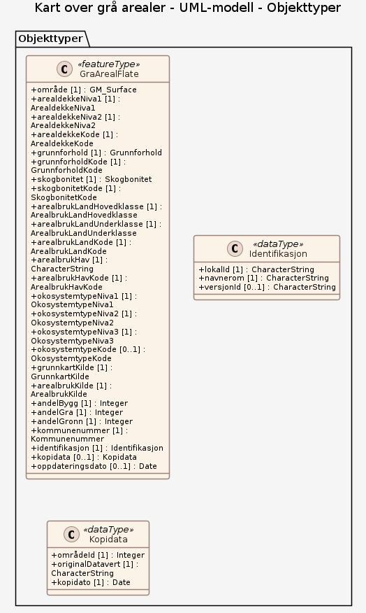

# Produktspesifikasjon: Kart over grå arealer

*Kart over grå arealet er utviklet i samarbeidet mellom Miljødirektoratet, Kartverket, NIBIO og SSB.

Kartet er landsdekkende og viser grå arealer i henhold til Kommunal- og distriktsdepartementet sin definisjon;
«Arealer som allerede er tatt i bruk eller sterkt påvirket av menneskelig bygge- og anleggsaktivitet, inkludert bebyggelse, konstruksjoner, permanente overflater og tilhørende arealer.»

Rapport kan leses her
<https://dokument.geonorge.no/nasjonale-standarder-og-veiledere/dokumentasjon-og-metode/kart-over-gr%C3%A5-arealer-sluttrapport/1/kart-over-gr%C3%A5-arealer-sluttrapport.pdf>

Oversikt over arealklasser som er med i kartet kan leses her
<https://register.geonorge.no/nasjonale-standarder-og-veiledere/dokumentasjon-og-metode/kart-over-gr%C3%A5-arealer-utvalg-fra-grunnkartet*>

**Nøkkelord:** Det offentlige kartgrunnlaget, geodataloven, arealplanerPBL, Natur

**Emnekategorier:** 

**Geografisk utstrekning**:

- **Vest**: 2.0
- **Øst**: 33.0
- **Sør**: 57.0
- **Nord**: 72.0

**Tidsmessig utstrekning**:

- **Tidsperiode**:
  - **Fra**: 2025-11-24
  - **Til**: 2026-04-10

## Om spesifikasjonen

> **Denne versjonen av produktspesifikasjonen:**  
> **Opprettet dato:** 2025-11-24 
> **Endret dato:** 2026-04-10 
> **Språk:** nor 
> **Kontaktinformasjon:** Miljødirektoratet, [magnhild.sletten@miljodir.no](mailto:magnhild.sletten@miljodir.no)

## Om produktet Kart over grå arealer

> **Romlig representasjonstype:** Vektor 
> **Unik identifikator:** <https://data.geonorge.no/sosi/arealbruk/kart_over_gra_arealer> 
> **Kontaktinformasjon:** Miljødirektoratet, [magnhild.sletten@miljodir.no](mailto:magnhild.sletten@miljodir.no)
>
> **Romlig oppløsning:**
>
>
>
> **Begrensninger:**
>
> **Juridiske begrensninger**:
>
> - **Tilgangsbegrensninger**: Norge digitalt begrenset
> - **Bruksbegrensninger**: Lisens
> - **Lisens**: Norge digitalt-lisens
> - **Lisenslenke**: <https://www.kartverket.no/geodataarbeid/norge-digitalt/partsinformasjon/avtaler-og-vilkar/norge-digitalt-lisens>

### Formål

Verktøy for planlegging 
Kartet skal kunne brukes som et verktøy for planlegging og bidra til å redusere nedbygging av natur - og jordbruksarealer, ved å synliggjøre allerede opparbeidede arealer.

Kartet er nå tilgjengelig og skal testes om det gir ønsket kunnskapsgrunnlag.

### Bruksområde

Lett tilgjengelige oversikter over grå arealer i Norge vil være et viktig kunnskapsgrunnlag for å kunne realisere en mer arealgjerrig arealpolitikk gjennom fortetting og transformasjon, før nye utbyggingsområder tas i bruk.

## Omfang

### Hele datasettet

**Nivå**: dataset

**Nivåbeskrivelse**: Gjelder hele datasettet. Hvis omfang ikke er oppgitt under en overskrift, gjelder teksten for hele datasettet og alle leveranser

### UML-modell

**Nivå**: dataset

## Datainnhold og struktur

### Datamodell - UML-modell

➡️ [Se full datamodell for omfang "UML-modell" (diagram per pakke og objektkatalog)](uml-modell/objektkatalog.html)

## Referansesystem

| EPSG-kode | Navn på referansesystem |
| --- | --- |
| [EPSG:25833](https://epsg.io/25833) | [EUREF89 UTM sone 33, 2d](https://register.geonorge.no/epsg-koder) |

## Datakvalitet

**Nivå**: dataset

**Kvalitetsmål**: Prosentvis oppfyllelse av FAIR-prinsipper

- **Målebeskrivelse**: Angir fullstendighet i forhold til krav fra FAIR-prinsippene (The FAIR Guiding Principles for scientific data management and stewardship)
- **Resultat**: 81

**Kvalitetsmål**: Prosentvis dekning i forhold til datasettets utstrekning

- **Målebeskrivelse**: Datasettets faktiske kartlagte areal i forhold til datasettets spesifiserte utstrekning
- **Resultat**: 100

**Kvalitetsmål**: Prosentvis oppfyllelse av FAIR-prinsipper

- **Målebeskrivelse**: Angir fullstendighet i forhold til krav fra FAIR-prinsippene (The FAIR Guiding Principles for scientific data management and stewardship)
- **Resultat**: 81

## Vedlikehold

**Vedlikeholdsfrekvens**: Ikke planlagt

**Status**: Under arbeid

## Presentasjon

**navn**: Tegneregler

**Lenke**:
<https://register.geonorge.no/tegneregler/kart-over-grå-arealer>

## Leveranse

| Tjeneste | Endepunkt | Type | Format | Leveranseenheter |
| --- | --- | --- | --- | --- |
| Geonorge nedlastning | [Lenke](https://nedlasting.geonorge.no/api/capabilities/c5f09d79-1546-495c-8b36-91efd4008bd7) | GEONORGE:DOWNLOAD | GeoPackage | fylkesvis, kommunevis, landsfiler |
| Atom Feed | [Lenke](http://nedlasting.geonorge.no/geonorge/ATOM-feeds/KartOverGraArealer_AtomFeedGeoPackage.xml) | W3C:AtomFeed | GeoPackage | fylkesvis, kommunevis, landsfiler |
| Kart over grå arealer WMS (Testversjon 1) | [Lenke](https://wms.nibio.no/cgi-bin/graastruktur?service=wms&request=GetCapabilities) | WMS-tjeneste | [{}] |  |
| GeoPackage: uml-modell | [Lenke](https://raw.githubusercontent.com/ToreFreddyB/produktspesifikasjon_nibio/main/produktspesifikasjon/kart-over-gra-arealer/uml-modell/uml-modell.gpkg) | Nedlasting | GPKG |  |

## Metadata

**Metadatastandard**: ISO19115

**Metadatastandardversjon**: 2003

**Metadatadato**: 2026-10-06

**språk**: nor

**Kontakt**:

- **Organisasjon**: Kartverket
- **Kontaktperson**: Bernt Audun Strømsli
- **Logo**: <https://register.geonorge.no/data/organizations/999601391_miljodirektoratet_liten.png>
- **Epost**: bernt.audun.stromsli@kartverket.no
- **rolle**: pointOfContact

**Metadataidentifikator**:

- **Utsteder**: Geonorge
- **kode**: c5f09d79-1546-495c-8b36-91efd4008bd7
- **koderom**: <https://kartkatalog.geonorge.no/metadata/>
- **Metadatalenke**: <https://kartkatalog.geonorge.no/metadata/c5f09d79-1546-495c-8b36-91efd4008bd7>

## Tilleggsinformasjon

- **Produktark:** [https://register.geonorge.no/produktark/kart-over-grå-arealer](https://register.geonorge.no/produktark/kart-over-grå-arealer)
